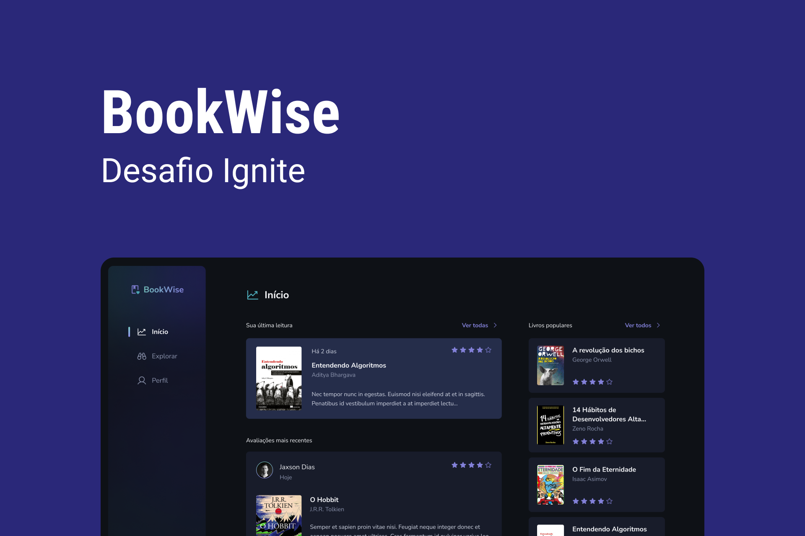

<div align='center'>
  
</div>

<h1 align='center'>
Book Wise
</h1>

<h4 align='center'>
Desafio 6 - Bootcamp Ignite Rocketseat - 2022-2023 🚀
</h4>


 # 💻 Projeto
 
Book wise é uma aplicação onde você tem acesso aos mais famosos livros, de diferentes genêros previamente cadastros. Está em dúvida se compra ou não aquele livro? No Book Wise você pode encontrar inúmeras reviews de leitores que já o leram e o avaliaram na plataforma. Claro, você também poderá avaliar um livro, bastando apenas se registrar/logar na aplicação utilizando sua conta do Google ou Github.

No que diz respeito a aplicação, ela foi desenvolvida utilizando Next.JS (React) + Typescript e como desafio do módulo 6 do Bootcamp Ignite (Rocketseat - 2022-2023), onde o objetivo era construir uma aplicação fullstack utilizando o próprio Next. Neste projeto foi aplicado diversos conhecimentos visto no módulo como: Integração com o Prisma, Server Side Rendering (SSR) e Static Side Generation (SSG), API Routes (Next), Fluxo de Autenticação com o Next-Auth, Docker, Deploy do Banco de Dados (Planet Scale) e da aplicação (Vercel), além de aplicar os conhecimentos visto nos módulos anteriores.

O Projeto também foi desenvolvido do total zero, apenas seguindo o layout proposto na plataforma do Figma, seguindo arrisca todos os parâmetros de cores, tamanho das fontes, espaçamento e estados em que cada elemento possa assumir na aplicação, além de, ter sido incluído alguns elementos a mais a fim de enriquecer o projeto.

Por fim, a aplicação está totalmente adequada a diferentes tamanhos de tela, desde ultrawide a telas dos menores smartphones.


 # 🧪 Tecnologias

Esse projeto foi desenvolvido com as seguintes principais tecnologias:
- [ReactJS](https://pt-br.reactjs.org/);
- [Typescript](https://www.typescriptlang.org/);
- [React Toastify](https://www.npmjs.com/package/react-toastify);
- [Prisma]( https://www.prisma.io/);
- [Next-Auth](https://next-auth.js.org/);
- [Next JS](https://nextjs.org/);
- [Stitches](https://stitches.dev);
- [Radix-UI](https://www.radix-ui.com/)
- [Days.js](https://day.js.org/);


# 🚀 Como executar

Clone o projeto e acesse a pasta do mesmo.

```bash
$ git clone https://github.com/rogerrm95/book-wise.git
$ cd book-wise
```
Para iniciá-lo, siga os passos abaixo:
```bash
# Instalar as dependências
$ yarn

# Iniciar o projeto
$ yarn start
```
O app estará disponível no seu browser pelo endereço http://localhost:3000.


# 🎨 Layout
Você pode visualizar o layout do projeto através do link abaixo:
- [Layout Web](https://www.figma.com/file/kvP1lQ487qLj4ymFKBsODr/Book-Wise?type=design&t=kUe9eDatrvTKeOHV-6) (Lembrando que você precisa ter uma conta no Figma).


# 📃 License
[MIT](https://choosealicense.com/licenses/mit/)
